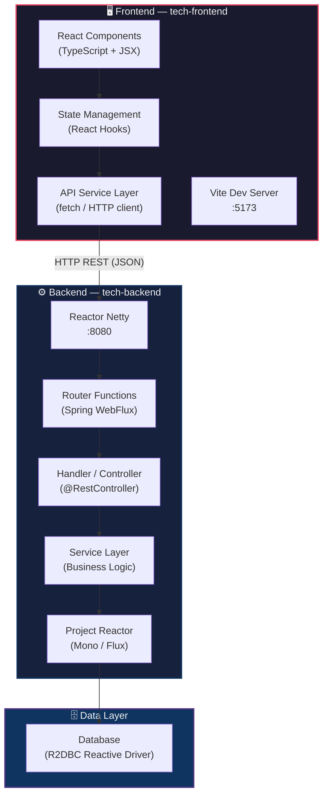
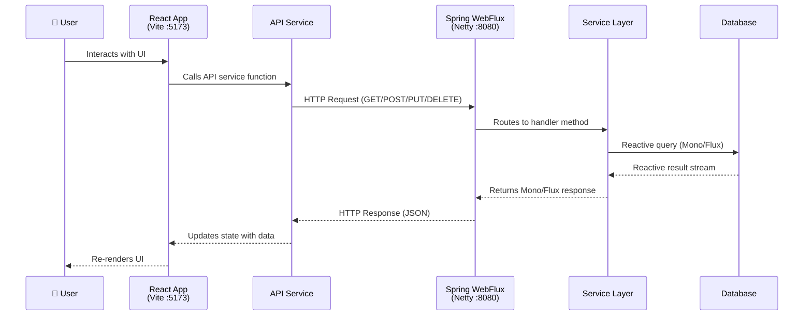
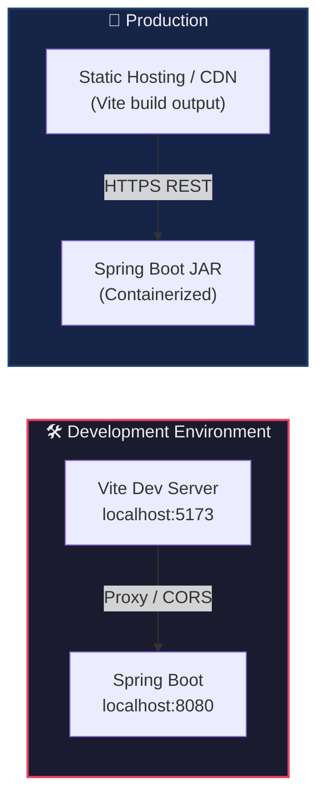

# Architecture — FISIANOS POC

## System Architecture Diagram

## Data Flow — Request/Response Cycle

## Deployment Topology

## Key Architectural Decisions

| Decision                     | Choice                        | Rationale                                                    |
| ---------------------------- | ----------------------------- | ------------------------------------------------------------ |
| Frontend Framework           | React + TypeScript            | Industry standard, strong ecosystem, type safety             |
| Build Tool                   | Vite                          | Instant HMR, fast builds, native ES modules                  |
| Backend Framework            | Spring Boot + WebFlux         | Non-blocking I/O, high throughput, backpressure support      |
| API Protocol                 | REST over HTTP/JSON           | Simplicity, broad tooling support, easy debugging            |
| Reactive Database Access     | R2DBC                         | Non-blocking database driver compatible with WebFlux         |
| Package Manager (Frontend)   | Yarn                          | Deterministic installs, workspaces support, speed            |
| Build Tool (Backend)         | Maven                         | Mature ecosystem, Spring Boot starter support                |
